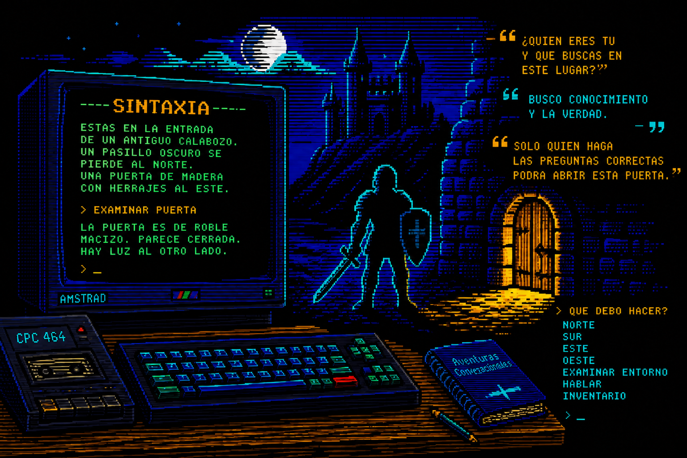

# SINTAXIA

> *"Del texto estructurado a la red neuronal: El retorno de la aventura conversacional a los 8 bits."*

<p align="center">
  
</p>

<p align="center">
  <em>IA + Amstrad CPC + M4 Board · narrativa, inventario y chip AY-3-8912</em>
</p>

**SINTAXIA** conecta un **Amstrad CPC real** (464/6128) a un LLM (Ollama, OpenAI, Claude, Gemini u API compatible) mediante la **[M4 Board](https://github.com/M4Duke/m4hardware)** (Wi‑Fi).

La IA genera la narrativa en lenguaje natural, el PC la empaqueta para el CPC (40 columnas, ASCII) y el cliente en Locomotive BASIC muestra el texto y dispara efectos en el chip **AY‑3‑8912**.

**Manual completo (instalacion PC/CPC, panel IU, comandos):** [docs/MANUAL.md](docs/MANUAL.md)  
**Guia sencilla para jugar (sin tecnicismos):** [docs/GUIA_JUGADOR.md](docs/GUIA_JUGADOR.md)

---

## Estructura del proyecto

```text
SINTAXIA/
  README.md
  run_server.bat          # atajo Windows
  client/
    aventura.bas          # cliente Locomotive BASIC (M4)
    TITLE.SCR             # pantalla de titulo MODE 1 (opcional)
  server/
    server.py             # HTTP :8080
    ai_adventure.py       # Ollama + historial
    protocol.py           # paquete T:/S:/E:
    cpc_text.py           # ASCII CPC + wrap 40
    prompts/master.txt
  tests/
  docs/                   # notas de carga / planes
  archivo/                # material local M4 (no publicado)
```

---

## Arquitectura

```text
Amstrad CPC + M4          PC (servidor)
─────────────────         ──────────────────────────
client/aventura.bas       server/server.py :8080
  INPUT  ──HTTP GET──►    Ollama / mock
  |HTTPGET ◄──────────    paquete T: / S: / E:
  PRINT + SOUND AY
```

| Pieza | Rol |
|--------|-----|
| `client/aventura.bas` | Cliente CPC (MODE 1, HTTP M4, parseo, SOUND, titulo) |
| `client/TITLE.SCR` | Splash grafico (generar con `python tools/make_title_scr.py`) |
| `tools/make_title_scr.py` | Convierte `server/web/hero.png` → TITLE.SCR |
| `server/server.py` | HTTP en puerto 8080 |
| `server/ai_adventure.py` | LLM (Ollama/OpenAI/Claude/Gemini/compat) + historial + reempaquetado |
| `server/llm_providers.py` | Defaults y mapeo de mensajes por proveedor |
| `server/protocol.py` / `cpc_text.py` | Contrato de paquete y texto CPC-safe |
| `server/prompts/master.txt` | System prompt del Master |

## Protocolo (cuerpo HTTP)

```text
T:linea1|linea2|linea3
S:2
E:0
```

- `T:` descripción; líneas ≤40 chars, separadas por `|` (máx. ~4)
- `S:` sonido `0`–`5` (neutro, peligro, ambiente, objeto, combate, victoria)
- `E:` `0` ok / `1` error  
- Fin de línea: **CRLF** (requerido por `LINE INPUT` del CPC)

---

## Requisitos

- PC con Python 3.10+
- [Ollama](https://ollama.com/) (recomendado: `llama3.1:8b`) o modo `--mock`
- Amstrad CPC + M4 Board en la misma LAN
- Firewall Windows: permitir TCP **8080** entrante

IPs de ejemplo usadas en el PoC:

| Nodo | IP |
|------|-----|
| PC servidor | `192.168.1.4` |
| M4 / CPC | `192.168.1.128` |

Ajusta la IP del PC en `client/aventura.bas` (línea del `|HTTPGET`) si cambia.

---

## Arranque del servidor (PC)

```bash
# Windows
run_server.bat
run_server.bat --mock
run_server.bat --model llama3.1:8b

# o manualmente
cd server
python server.py
python server.py --mock
```

**Panel web:** [http://127.0.0.1:8080/ui](http://127.0.0.1:8080/ui)  
Ahí puedes elegir mock / Ollama / OpenAI / Claude / Gemini / Compatible, modelo, temperatura, system prompt, ver el último paquete `T:/S:/E:`, inventario/estado, **guardar/cargar slots 1–3** y reiniciar partida. Al cambiar de proveedor se rellenan URL y modelo típicos; pasa el ratón por cada control para ver ayuda.

Prueba rápida:

```bash
curl http://127.0.0.1:8080/ping
curl "http://127.0.0.1:8080/turn?msg=miro+alrededor"
curl "http://127.0.0.1:8080/turn?msg=SAVE+1"
curl "http://127.0.0.1:8080/turn?msg=LOAD+1"
curl http://127.0.0.1:8080/reset
```

Más detalle: **[docs/MANUAL.md](docs/MANUAL.md)** (manual de usuario) y `docs/CARGA.md` (carga rapida en SD).

---

## Cliente en el CPC

1. Copia `client/aventura.bas` y `client/TITLE.SCR` a la microSD de la M4
   (si no carga como ASCII, `SAVE"aventura` desde un emulador y copia el `.bas` tokenizado)
2. En el CPC: `|NETSTAT` y comprueba IP
3. `RUN"aventura`
4. Escribe acciones en español natural (`miro alrededor`, `voy al norte`, …).  
   Comandos: `INV`, `SAVE 1`–`3`, `LOAD 1`–`3`, `SAVES`, `NUEVA`, `AYUDA`, `QUIT`.

Prueba manual de red desde BASIC:

```basic
a$="@192.168.1.4:8080/ping>PING.TXT"
|HTTPGET,@a$
OPENIN "PING.TXT"
LINE INPUT #9,a$:PRINT a$:CLOSEIN
```

---

## Sonidos AY (`S:`)

| Código | Efecto |
|--------|--------|
| 0 | Silencio |
| 1 | Peligro: grave + fade ENV/ENT |
| 2 | Ambiente: eco suave 2 canales |
| 3 | Objeto: arpegio con envolvente |
| 4 | Combate: golpe + ruido AY |
| 5 | Victoria: fanfarria ascendente |

---

## Tests

```bash
cd server
python -c "from protocol import build_packet, parse_packet; print(parse_packet(build_packet(['Hola'],2)))"
```

---

## Roadmap breve

- Pulir coherencia LLM con I/L/F
- Más atmósfera en BASIC
- (Largo) cliente TCP Z80 / `C_NET*`

---

## Créditos / hardware

- M4 Board — [M4Duke/m4hardware](https://github.com/M4Duke/m4hardware)
- Inspirado en la tradición de aventuras conversacionales españolas de los 80

## Licencia

A definir por el mantenedor del repositorio.
